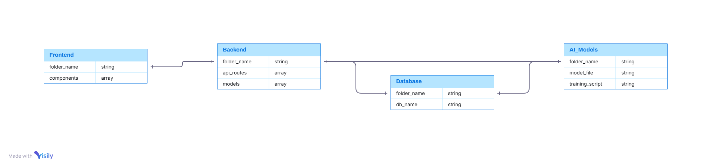

Note: We are taking break from 14th Sept to 26th Sept due to our college exams so we won't be merging or assigning any of the prs or issues!

<div align="center">
  
#  WardhaMetroFlow
An AI-powered metro simulation designed for the city of Wardha, envisioning a smarter, data-driven public transit system.
</div>

## Featured Website Image


<span id="top"></span>


## Featured Map Structure


[Map Link](https://www.google.com/maps/d/u/3/edit?mid=1c4r4UD15ZKHhCvG5O3ZN_JOQdhHPspM&usp=sharing)


## Join Our Community

Join the discussion, get real-time updates, and collaborate with other developers on our Discord server.

[](https://discord.gg/GGpWdd639J)

Whether you're contributing code, suggesting features, or just curious about the project, you're welcome!

## Table of Contents
- [About the Project](#about-the-project)  
- [Key Features](#features)  
- [Tech Stack](#tech-stack)  
- [System Architecture](#system-architecture)  
- [Getting Started](#getting-started)  
- [Project Structure](#project-structure)  
- [Contributing](#contributing)  
- [License](#license)  
- [Acknowledgments](#acknowledgments)  


## About the Project
<a id="about-the-project"></a>

**WardhaMetroFlow** is a proof-of-concept simulation platform that demonstrates how AI can enhance urban mobility in emerging smart cities. Inspired by *India's Smart City Mission*, this project provides a tool for both passengers and administrators to interact with a virtual metro system.

It offers two distinct, interactive views:

- **Passenger View**: A user-facing interface for planning journeys. Passengers can select their start and end points, receive intelligent route suggestions, and see estimated arrival times.  
- **Admin View**: A comprehensive dashboard for transit authorities. Administrators can monitor metro traffic in real-time, manage station data, and analyze predictive models for traffic flow and potential congestion.  

## Key Features
<a id="features"></a>

- **Interactive Route Planning**: A map-based interface for easy route selection.  
- **Real-time Simulation**: Simulates passenger flow and station activity.  
- **AI-Powered Predictions**: Utilizes machine learning models for route optimization and traffic forecasting.  
- **Dual Dashboards**: Separate, feature-rich interfaces for passengers and administrators.  
- **Voice/Text Input**: Optional voice and text commands for accessibility.  
- **Scalable Architecture**: A modular codebase designed for expansion and easy maintenance.  

## Tech Stack
<a id="tech-stack"></a>

| **Category**    | **Technology**                          |
|------------------|------------------------------------------|
| Frontend         | React.js, Leaflet.js, HTML/CSS, JavaScript |
| Backend          | Python (Flask / FastAPI)                |
| AI / ML          | scikit-learn, pandas, NumPy             |
| Visualization    | Chart.js, Plotly                        |
| Database         | SQLite / Firebase / MongoDB             |


## System Architecture
<a id="system-architecture"></a>

The components of **WardhaMetroFlow** interact as follows:

1. The **Frontend (React)** communicates with the **Backend (Flask/FastAPI)**.  
2. The **Backend** processes requests, serves API routes, and contains the core application logic.  
3. The **Database (SQLite)** stores all metro, station, and passenger data.  
4. The **ML Model (model.pkl)** is loaded by the backend to provide predictions for route optimization and traffic analysis.  
   



## Getting Started
<a id="getting-started"></a>

> **Note**: Setup instructions are a work in progress. Contributions to improve this section are welcome.

To get a local copy up and running, follow these steps:

### Clone the Repository
```bash
git clone https://github.com/GSSoC-Flow/WardhaMetroFlow.git
cd WardhaMetroFlow
```
### Set Up the Backend
```bash
cd backend
pip install -r requirements.txt
# Run the backend server (example command)
# python app.py
```
### Set Up the frontend
```bash
cd ../frontend
npm install
npm start.
```

## Project Structure
<a id="project-structure"></a>
```
WardhaMetroFlow/
│
├── ai-models/             # AI/ML models and training scripts
│   ├── passenger_flow_model.py
│
├── api_models/            # Pre-trained model files and notebooks
│   ├── model.pkl
│   └── train_model.ipynb
│
├── backend/               # Backend logic (Flask/FastAPI)
│   ├── app.py
│   └── models/
│       ├── __init__.py
│       └── models.py
│
├── database/              # SQLite database
│   └── wardha.db
│
├── frontend/         # frontend (Passenger/Admin UI)
│   │
│   ├── passenger/
│   │   └── passenger.html
│   │
│   └── admin/
│       └── admin.html
│
├── static/                # Static assets
│   └── Architecture.png
│
├── .gitignore
├── CODE_OF_CONDUCT.md
├── Contributing.md
├── Contributors.md
├── LICENSE
├── README.md
└──vercerl.json.
```

## Contributing
<a id="contributing"></a>

We welcome all contributors—whether you're interested in frontend, backend, machine learning, or documentation!

### Contribution Steps
1. **Fork** the repository.  
2. **Create a new feature branch**:  
   ```bash
   git checkout -b feature/YourFeatureName
3. **Commit your changes:**
  ```bash
  git commit -m "Add: YourFeatureName"
```
4. **Push to the branch:**
  ```bash
  git push origin feature/YourFeatureName
```
5. **Open a Pull Request.**
Please refer to **Contributing.md** for more detailed guidelines.


### Contribution Points
We value all contributions and assign points based on complexity and effort.  
This helps us track and reward contributor impact.  

| **Area**              | **Points** | **Difficulty Level** |
|------------------------|------------|-----------------------|
| Backend Development    | 30         | 3                     |
| Map / Leaflet.js       | 30         | 3                     |
| Frontend Development   | 15         | 2                     |
| Documentation          | 10         | 1                     |


## Good First Issues
* Looking for a place to start? Here are some ideas:
* Add a new station to the map data.
* Create a sample JSON file for a new metro route.
* Improve the accuracy of the route prediction model.
* Enhance the styling of the Passenger dashboard.
* Optimize data visualization components on the Admin dashboard.


## License
<a id="license"></a>

This project is licensed under the [MIT LICENSE](LICENSE).
See the **LICENSE file** for details.


## Acknowledgments
<a id="acknowledgments"></a>
Inspired by India's Smart City Mission.
Built with love by open-source contributors during GSSoC 2025.

<p align="center">
  <a href="#top"> Back to Top</a>
</p>

